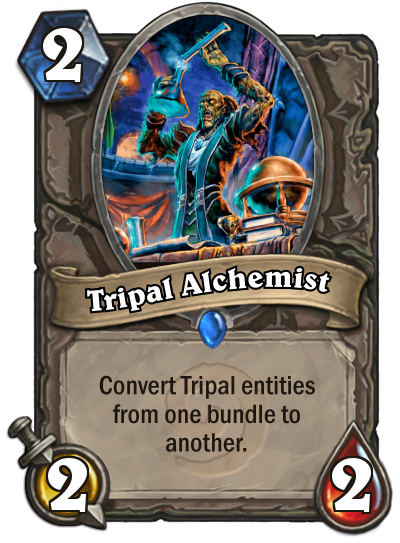
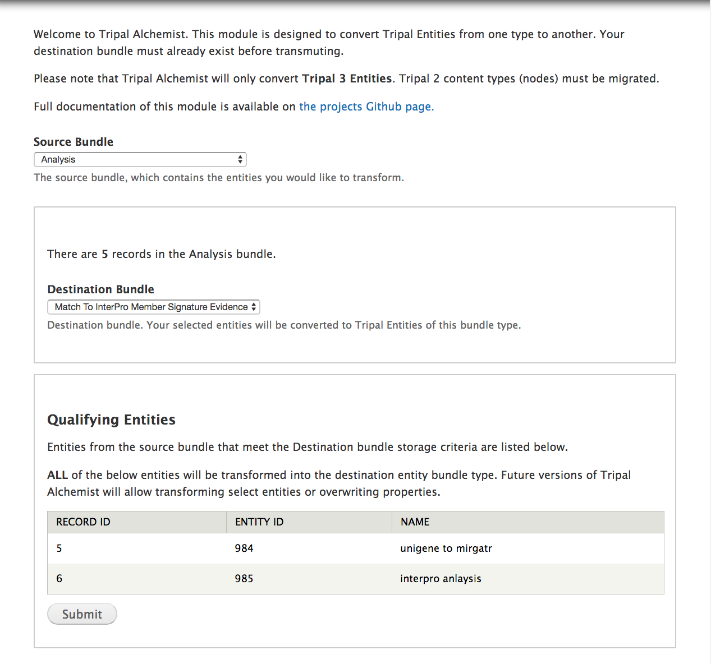

Tripal Alchemist allows you to **transmute** (convert) entities from one type to another.

>
> Tripal Alchemist 

Tripal 3 provides migrations for most base content types.  Some content types (namely Analysis) convert all nodes to a single bundle type.  This is not great if you make heavy use of submodules that define their own node type: in the case of analysis, this includes analysis_expression, analysis_unigene, etc.  You also might decide later down the road that you want to redefine some of your `mrna` features as `mrna_contig`, for example.

In both cases, Tripal Alchemist provides a simple interface to easily convert entities from one bundle to another, provided that the destination bundle exists, has the same base table as the source bundle, and the destination bundle was defined with the `type column` and `property value` properly set.

This module is under active development and is not yet released.

## Usage

* Define a destination bundle that is the same base table as your source bundle
* Navigate to the transmuter, located at `/admin/tripal/extension/tripal_alchemist`.
* Select a source bundle.  This is the current content type, and qualifying entities from this type will be transformed.
* Select a destination bundle.  This is what you want to turn your content into.
* Run **Transmute**.
* You're done!

>
> The Tripal Alchemist Transmutation form.  If any entities qualify for your new bundle type from the selected bundle type, they will appear in the table at the bottom of the form.

## License and Contributing

Tripal Alchemist is open source and provided under the [GPL-3.0 license](https://github.com/statonlab/tripal_alchemist/blob/master/LICENSE).  It was created by Bradford Condon and Meg Staton from the University of Tennessee Knoxville.

The Tripal Alchemist "logo" is derived from the collectible card game Hearthstone, copyright © Blizzard Entertainment, Inc. Hearthstone® is a registered trademark of Blizzard Entertainment, Inc. Tripal Alchemist is not affiliated or associated with or endorsed by Hearthstone® or Blizzard Entertainment, Inc.