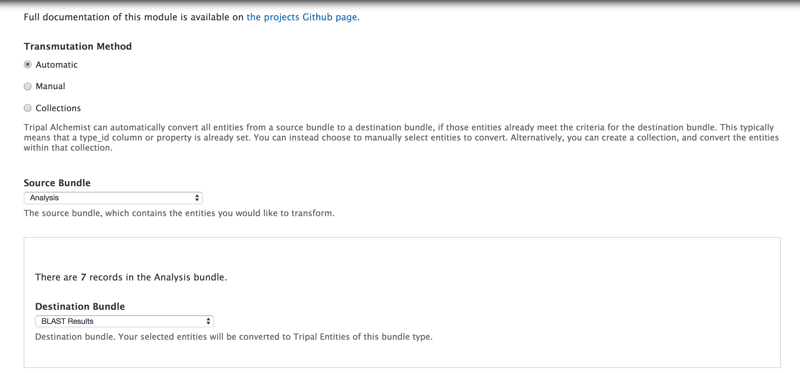
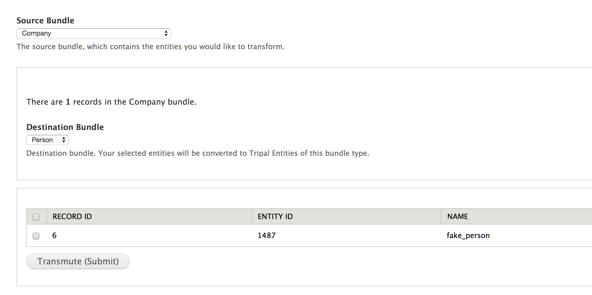
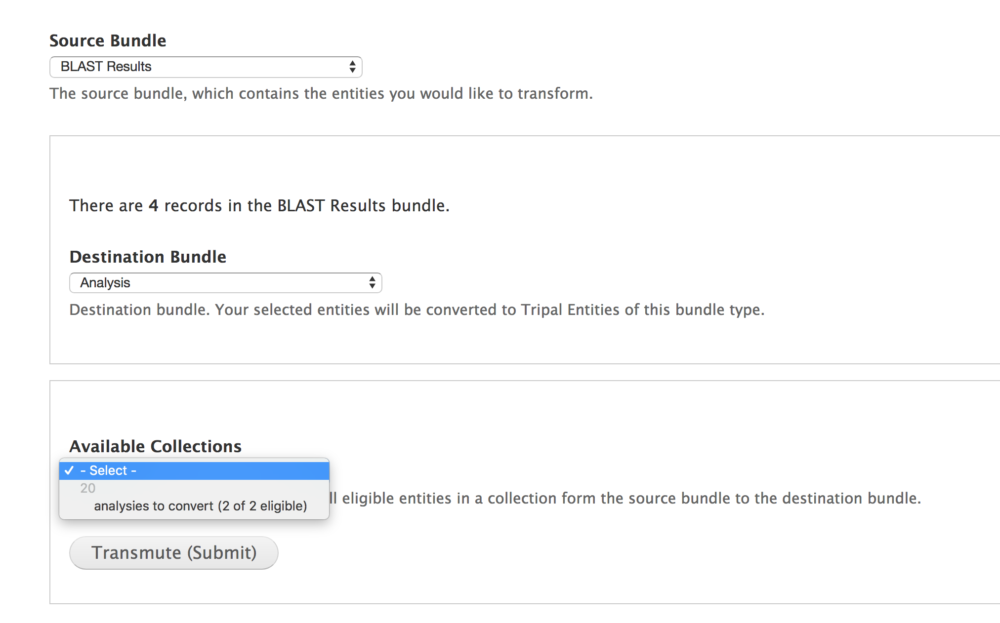

Tripal Alchemist allows you to **transform**  entities from one type to another.

## Background 

Tripal 3 provides migrations for most base Chado content types.  Some content types (namely Analysis) convert all nodes to a single bundle type.  This is not great if you make heavy use of submodules that define their own node type: in the case of analysis, this includes analysis_expression, analysis_unigene, etc.  You also might decide later down the road that you want to redefine some of your `mrna` features as `mrna_contig`, for example.

This module is under active development, and is released as v0.2.

## Features

* Transform Tripal entities from one type to another based on their existing bundle-defining property
* Manually override entity properties and transform select elements
* Trying to convert a large but specific subset of entities?  Create a collection, then convert the entities in that collection

## Usage

* Define a destination bundle that is the same base table as your source bundle.  [You can follow this guide to learn how to define new bundles](docs/defining_a_new_bundle.md).  
* Navigate to the transformer, located at `/admin/tripal/extension/tripal_alchemist`.
* Select a transformation type.  Alchemist currently has three modes:
  - **Automatic**.  Only entities whose properties currently match the destination bundle will be converted.
  - **Manual**.  A select table will allow you to pick which entities are converted, regardless of their Chado type property.
  - **Collection**.  Use a Tripal collection to determine which entities will be converted, regardless of their Chado type property.
* Select a source bundle.  This is the current content type, and qualifying entities from this type will be transformed.
* Select a destination bundle.  This is what you want to turn your content into.
* Run **Transform**.
* You're done!

>
> The Tripal Alchemist Transmutation form.  If any entities qualify for your new bundle type from the selected bundle type, they will appear in the table at the bottom of the form.

### Transmutation modes

#### Automatic

Automatic mode will effect **all** source entities whose chado records qualify them for the destination bundle.  This might be the case if your entity was published as a base type, and later split into multiple types.  Alternatively, you can modify the properties of select entries manually or using SQL, making them elligible for automatic transformation.

#### Manual

The manual transmutation mode is for quickly transforming a small subset of entities.  Unlike automatic mode, manual transformation can convert any source entity, **regardless of its Chado property**.  This means that an entity whose type qualifies it as a source bundle can be converted to the destination bundle, with its Chado type property rewritten.  Note that the select table is limited to 500 entries.  If you need to manually convert more entries, consider creating a **collection** instead.

>
> Manual transformation.  Check the box next to an entity to transform it into the destination type.

#### Collections

If you are transforming a large set of entities that are not elligible for automatic transformation, you can create a collection containing those entities.  Tripal Alchemist will transform all of the entities in the collection from the **selected base entity type** to the destination type.  Like manual transformation, collections allow you to convert entities whose Chado properties don't yet match the destination bundle. 

>
> Transforming a collection.  Creating a collection elsewhere (IE elasticsearch) allows you to easily select the entities you want to transform.

Tripal Alchemist will only display collections that contain entities from the select source bundle type.

## FAQ

### How do I create a destination bundle type?

Please check out my [guide on defining a bundle](/docs/deining_a_new_bundle.md).

### How are entities converted?
Tripal allows multiple entities to be mapped to the same base table.  It distinguishes these via a type_id, which is stored either directly in the base table, or in a connected prop table.  
Tripal Alchemist changes those properties for you to match the selected destination bundle.  Tripal Alchemist then migrates the entities from the sosource to the destination `Chado_bio_data` table, and updates the `Tripal_Entity` table.

### Why do my source and destination bundles need the same Chado base table?

Alchemist only alters the type property of the underlying Chado record.  Transforming records from one Chado table to another would be difficult or impossible, as the required fields would all be different.

### Can Alchemist convert entities that are not Chado entities?

No.  As of the current release, Tripal Alchemist can only convert Tripal Entities with Chado storage backends.

## License and Contributing

Tripal Alchemist is open source and provided under the [GPL-3.0 license](https://github.com/statonlab/tripal_alchemist/blob/master/LICENSE).  It was created by Bradford Condon and Meg Staton from the University of Tennessee Knoxville.  Tripal Alchemist doesn't do everything I wish it did.  If you have feature requests, bug reports, or contributions, please head to the issues queue and create an issue.  If you would like to make a contribution, simply fork the repo and make a pull request from there.

The Tripal Alchemist "logo" is derived from the collectible card game Hearthstone, copyright © Blizzard Entertainment, Inc. Hearthstone® is a registered trademark of Blizzard Entertainment, Inc. Tripal Alchemist is not affiliated or associated with or endorsed by Hearthstone® or Blizzard Entertainment, Inc.
