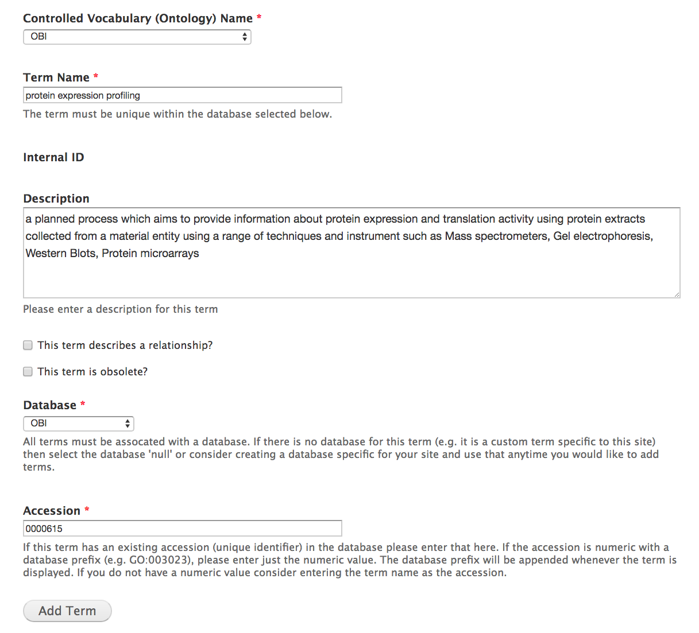
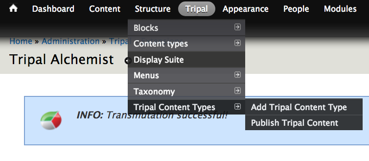
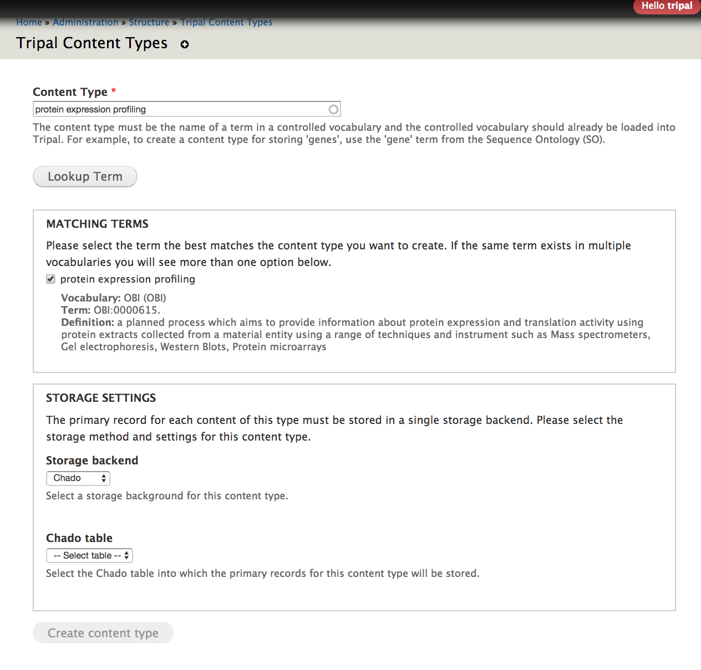
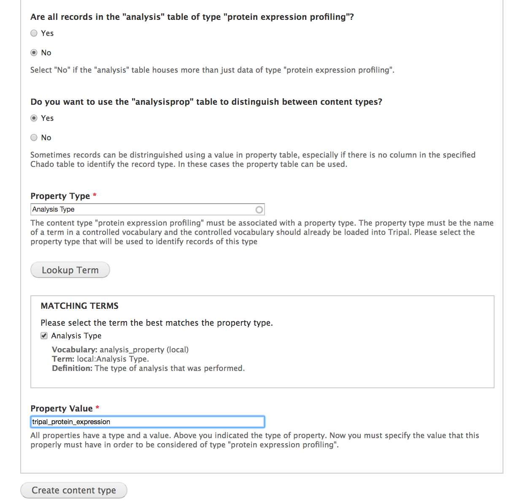

# Tripal Alchemist: Defining Bundles

Before you can transmute entities from one type to another, you need to define the destination and source entity bundles.  When using this module, you might have to create the destination bundle yourself.  This guide details how to do this.

Keep in mind that you **must** have some way of differentiating your entities.  This means that at the step where you are asked if all records in the Chado base table will be of this type, your answer must be **no**.

## Quick Guide

* Pick an appropriate CVterm for your bundle.  I recommend using the [EBI Ontology Lookup Service](https://www.ebi.ac.uk/ols/index).
* If not already in Chado, insert the CVterm.
* Match your new bundle to the CVterm.
* Set the Storage backend to Chado.
* Select the appropriate Chado Table.
* Determine if this term is the exclusive user of this Chado table.  If it is, you can select "Yes" when asked if all records in the Chado table will be of this type, and press "Create Content Type".
* if the Chado Table is shared, select the appropriate method for distinguishing content types. This will either be a *property table* or a *type_id* column in the base table.
* If using a property table, specify a property type cvterm.
* Select the matching property value to distinguish this type.

## Detailed Guide

This guide will demonstrate how to define a new Chado content type with Tripal 3.  There is a similar guide [on tripal.info](http://tripal.info/tutorials/v3.x/content-types) which you can also review.

For the purposes of this demo, let us assume that we have a custom module for storing proteomic analyses.  Our module had a custom node, analysis_proteome, and after migrating to Tripal 3, all those nodes were converted to one generic analysis type.

### Picking a CVterm

Before we begin, let's pick an appropriate CVterm for our bundle.  The ideal term will be specific enough to not overlap with other content, but broad enough to work for other users who might download your module.  For example, we wouldn't want to say "flatworm proteome analysis" when "proteome analysis" works just as well.
I recommend using the [EBI Ontology Lookup Service](https://www.ebi.ac.uk/ols/index).  In our case, I've found a reasonable term in the OBI ontology: [protein expression profiling
](https://www.ebi.ac.uk/ols/ontologies/obi/terms?iri=http%3A%2F%2Fpurl.obolibrary.org%2Fobo%2FOBI_0000615).

Next, make sure the term is in your database.  If you've already loaded the entire CV or ontology you found your term in, you can skip this step.  Otherwise, go to /admin/tripal/loaders/chado_vocabs/chado_cvterms in the admin menu and select **+ Add Term.**  Be sure to fill out the CV, DB, accession, and Term Name fields correctly: for a detailed guide on this topic, please see [the guide available in the Tripal Fields Generator Tool](https://github.com/statonlab/fields_generator/blob/master/CV_guide.md).

>
> After finding an appropriate CVterm, use the chado cvterm loader to insert it if not already present in your database.

A note: if you are stumped, or can't seem to find a good CVterm, you can use the local CV, but this is discouraged.   

### Bundle Creation

Now that we have a CVTerm for our bundle, let's add it to Tripal.  You can add a new Tripal Content Type (Bundle) by navigating to Structure -> Tripal Content Types -> Add Tripal Content Type in the admin menu.  To fill out this form, we need to know our CVterm, what Chado base table our bundle uses, and how the content type is differentiated if the table is shared.  In the case of our demo Protein Expression Profiling bundle, we know that it is one of several content types using the *Analysis* Chado base table. 

>
>
> You can create new Tripal Content Types (bundles) via the admin panel by navigating to Structure -> Tripal Content Types. 

> 
> First, assign your term to your bundle.  You should have a term in the *Matching Terms* box after pressing Lookup Term.

There are three possible storage configurations for your bundle.

1)  Your bundle is the only content type mapped to this base table.  If you don't need special functionality or fields for any subtype, this is the best choice.
2)  Your bundle shares the base table, and is distinguished by a *type_id* column.  If this is the case, your chado base table will have a *type_id* column that holds a cvterm_id foreign key.  That cvterm will be the type.
3)  Your bundle shares the base table, and is distinguished by a *linker table*.  For the analysis table, this could be `analysisprop`, but it could also be `analysis_cvterm`.

Tripal will **automatically make suggestions**for where to store the type based on your Chado schema.
 

> 
> In this example, we specify our bundle type in the analysisprop table.  There is a property associated with our analysis via this table where the type_id matches the cvterm we specify (Analysis Type), and the corresponding value should be tripal_protein_expression.

For our Protein Expression Profiling bundle, we want to use the `analysisprop` table.  Tripal (and Tripal Alchemist!) will look for entries in the analysis table that have a property in the analysisprop table where type_id = the cvterm for the type (Analysis Type in this case).  Tripal will know that the analysis is a Protein Expression Profiling if the `value` column of that property is equal to the text we specified: `tripal_protein_expression`.  For analyses created by modules, this is the convention: set the Analysis Type cvterm equal to the *module name*.

### Populating our Bundle

Now that our bundle exists, we can create new content directly by going to Content -> Tripal Content -> + Add Tripal Content.

If you've already got Tripal 2 nodes for your content, you can migrate them using the core migrator available at Tripal -> Data Storage -> Chado -> Migrate.  Analyses will all migrate to the Analysis content type, so you can use *Tripal Alchemist* to migrate your content *from* Analysis *to* the new bundle type.  For our ddemo, this would be Protein Expression Profiling.
